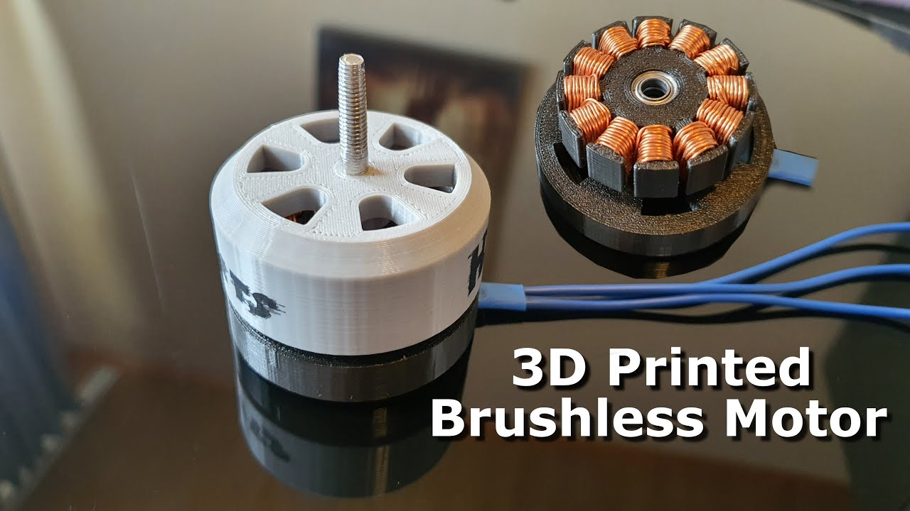
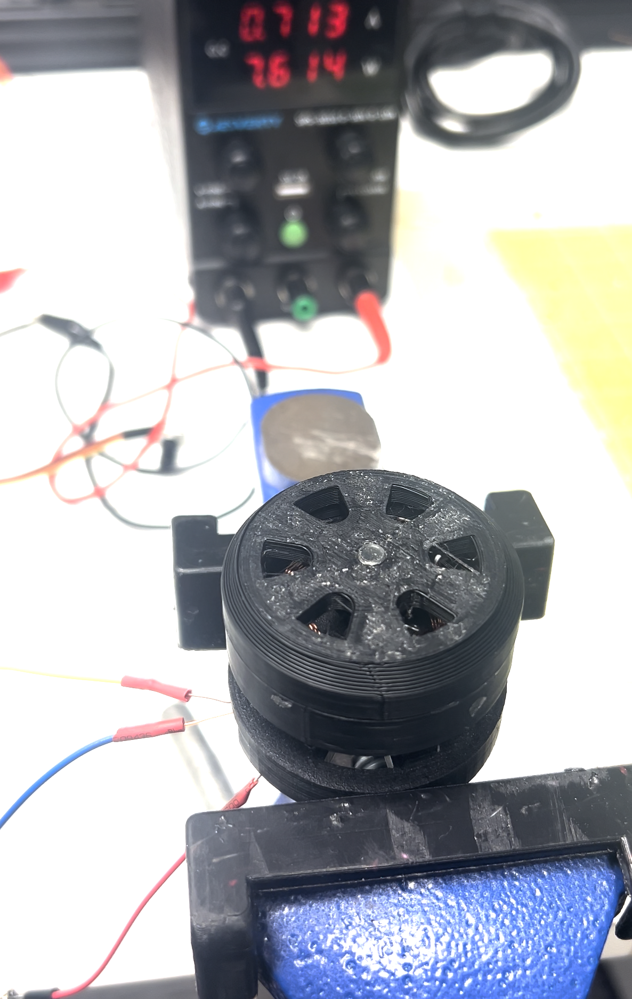
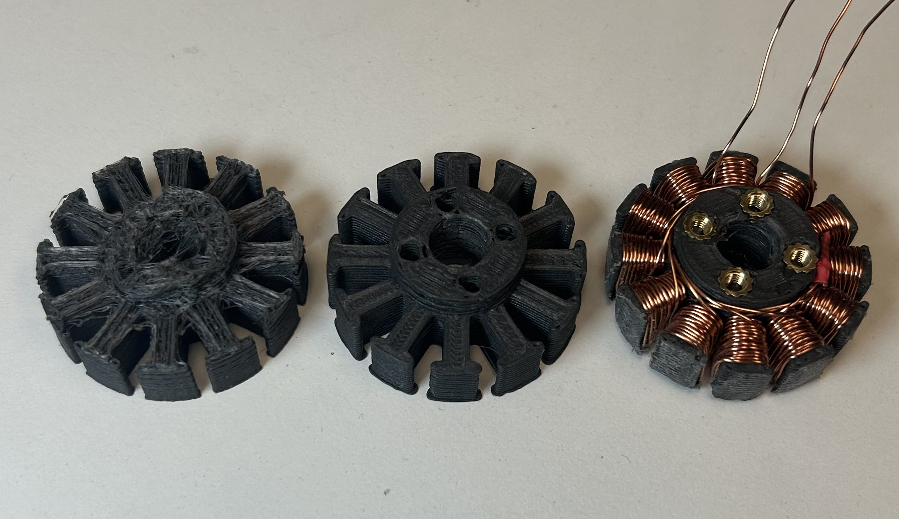
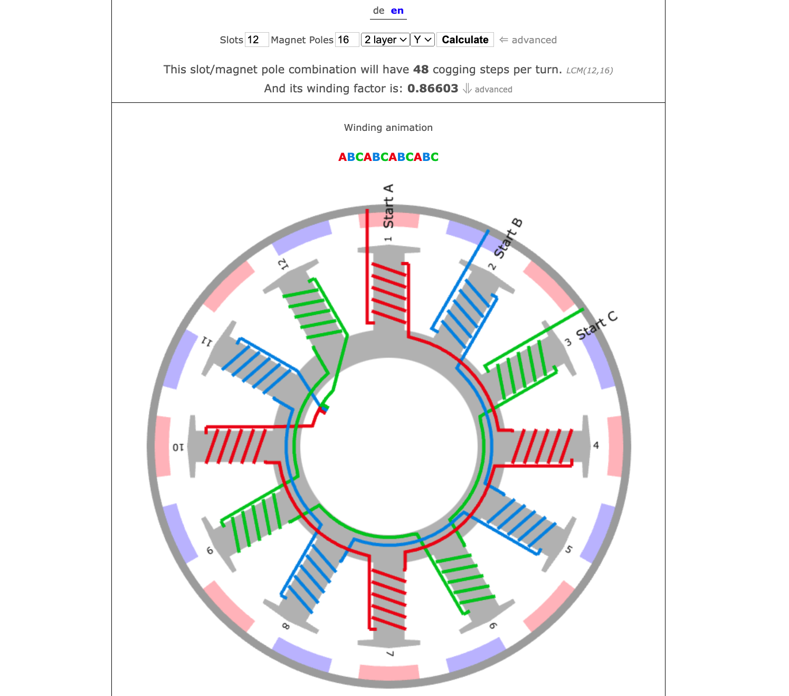

# 3D Printed Brushless DC Motor Analysis

I recently saw [this video by HM Projects](https://www.youtube.com/watch?v=OZarwftUh8w) where he builds a 3D printed motor. I have not been successful in replicating this build so I am compiling my notes here to figure out why my version does not work ([video](./)). When power is connected the motor just shakes it does not rotate as shown in the video. I have tested my ESC with a working BLDC motor and the ESC works fine.

[Winding Scheme Calculator](https://www.bavaria-direct.co.za/scheme/calculator/)

### Source Files
All of the original files can be found in [./source](./source) but were originally downloaded from https://drive.google.com/drive/folders/1Au5g3SLIfi7Hd1thS2vI8csxB3VvxQ5b

### Parts Used
| Part | Price | Link |
| ------------- | ------------- |  ------------- |
| Magnetic Viewing Film | $7.99 | [Amazon](https://www.amazon.com/dp/B07CGMG1JL) |
| 0.5mm Enameled Copper Wire | $14.69 | [Amazon](https://www.amazon.com/dp/B0CYPC632R?) |
| 10x5x2mm Neodymium Magnets | $6.99 | [Amazon](https://www.amazon.com/dp/B0CT8MQJ99) |
| 5x9x3mm MR95-2RS Bearings | $9.79 | [Amazon](https://www.amazon.com/dp/B0B5XNJ7X7) |
| BLDC Controller ESC | $16.49 | [Amazon](https://www.amazon.com/dp/B08NC2DDP3?) |
| M3 Threaded Inserts | $8.99 | [Amazon](https://www.amazon.com/dp/B0CYL92VTF?) |
| Ferromagnetic Iron PLA | $34.99 | [Amazon](https://www.amazon.com/dp/B00X8BQYPS?) |

### Troubleshooting
Below are some troubleshooting steps I took to try and get this working

- **Ferromagnetic Stator** - I have printed the stator using Ferromagnetic PLA
- **Reversied windings** - Winding the coils counter-clockwise.
- **Alternative Magnet arangement** - All north or all south (I was running out of ideas)
- **14 Pole Rotor** - Have re-designed the rotor to support 14 poles (magnets)

### Build Process

I printed the stator, wired it as shown in the video and winding scheme calculator. Then soldered the connections to the motor, inserted the bearings, then mounted it to the stator base.

Next I checked the orientation of the magnets with magnetic viewing film and a magnetic pole detector.

I marked each of the magnets with a sharpie so I knew the correct way to install each magnet.

After installing the magnets, I used the magnetic film to check the magnetic fields of the rotor

Then I attached the rotor to the stator, hooked it up to my ESC and powered it up. But the motor just shakes back and forth it does not rotate. [Video](./video.mov)

### Other Images

